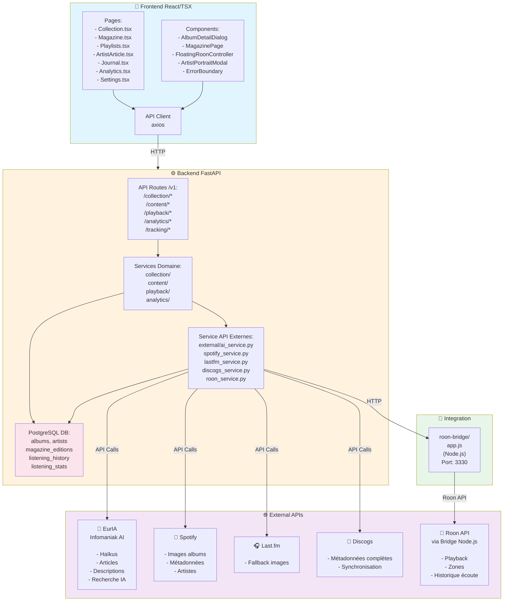
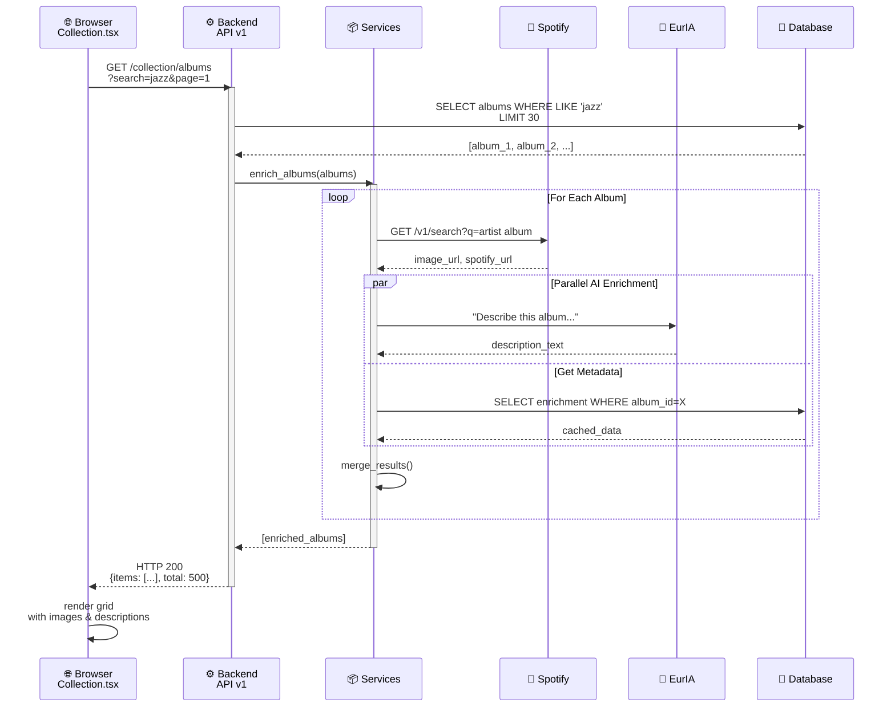
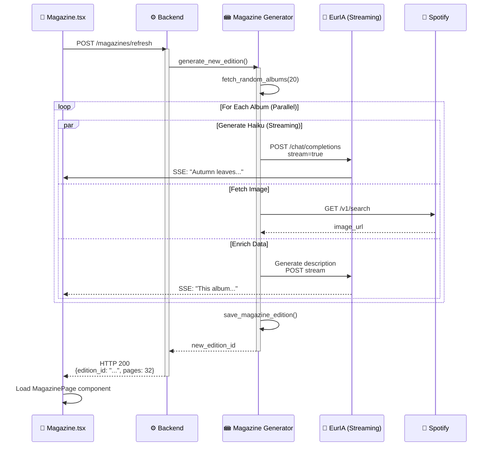
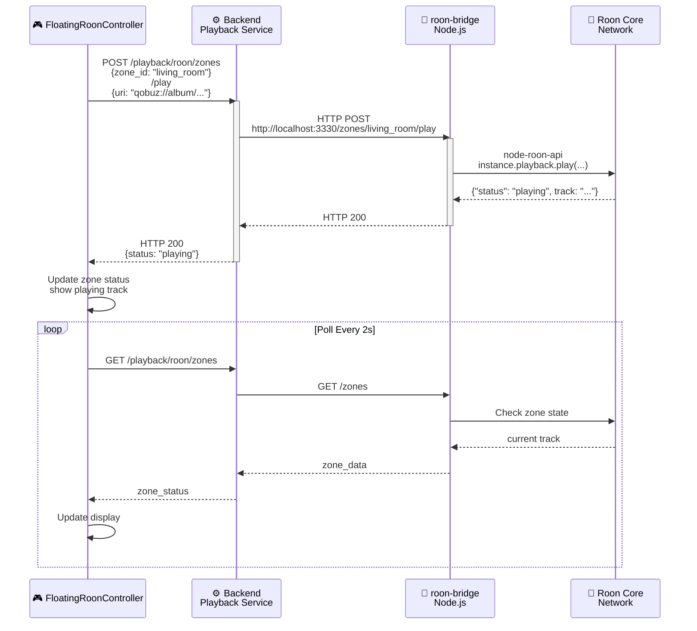
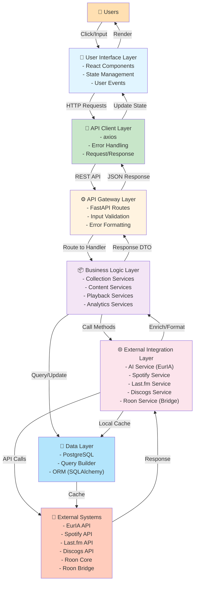

### Data Flow Examples







### Architecture Layer Diagram



---

## 🔁 Common Integration Patterns

### Pattern 1: Simple Data Fetch + Enrich
```
Frontend Page Request
    ↓
Backend Route Handler
    ├─ Query DB (cache)
    ├─ Missing data?
    │  └─ Call External API
    └─ Return enriched data
    ↓
Frontend Render
```
**Used by:** Collection.tsx, Analytics.tsx, Journal.tsx

### Pattern 2: Stream Generation
```
Frontend Action (e.g., "Generate")
    ↓
Backend POST Handler
    ├─ Validate input
    ├─ Start Stream to Frontend
    └─ For Each Item:
       ├─ Call AI/External API
       ├─ Send SSE chunk
       └─ Save to DB
    ↓
Frontend Receive Chunks
    ├─ Display in real-time
    ├─ Accumulate results
    └─ Final refresh
```
**Used by:** Magazine.tsx refresh, Haiku generation

### Pattern 3: Real-time Control
```
Frontend User Action
    ↓
Backend Handler (Playback)
    ├─ Translate to Bridge command
    ├─ HTTP call to Bridge
    ├─ Bridge calls Roon Core
    └─ Return status
    ↓
Frontend Poll Loop
    ├─ GET /zones every 2s
    ├─ Update local state
    └─ Render controls
```
**Used by:** FloatingRoonController, Playback controls

---
