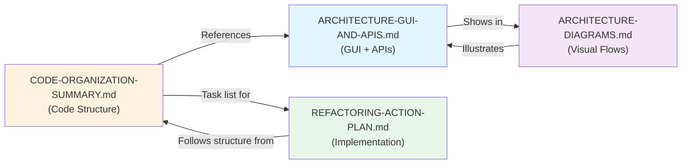

# 📚 Index - Documentation Architecture AIME

**Last Updated:** 7 février 2026

---

## 🎯 Documents d'Architecture

### 1. 📊 [CODE-ORGANIZATION-SUMMARY.md](CODE-ORGANIZATION-SUMMARY.md)
**Primary document** pour la structure du code et refactoring

**Contient:**
- Vue d'ensemble problèmes et solutions
- État actuel vs cible
- Plan de consolidation des services
- Duplication audit détaillée
- Phases d'implémentation

**Quand le consulter:**
- Comprendre pourquoi le refactoring
- Identifier les doublons de code
- Planifier la migration vers la nouvelle structure

---

### 2. 🏗️ [ARCHITECTURE-GUI-AND-APIS.md](ARCHITECTURE-GUI-AND-APIS.md)
**Comprehensive guide** à l'interface graphique et API externes

**Contient:**
- Vue générale flux client-serveur
- Pages React détaillées (Collection, Magazine, Playlists, etc.)
- Composants réutilisables
- 5 API externes expliquées:
  - 🧠 EurIA (Infomaniak AI)
  - 🎵 Spotify
  - 🎧 Last.fm
  - 📀 Discogs
  - 🎼 Roon API
- Flux requête-réponse détaillés
- Matrice: Composants → Services → APIs
- Configuration secrets/env vars
- Points d'amélioration future

**Quand le consulter:**
- Ajouter une nouvelle page ou composant
- Intégrer une API externe
- Déboguer flux de données
- Optimiser intégration tiers

---

### 3. 🎨 [ARCHITECTURE-DIAGRAMS.md](ARCHITECTURE-DIAGRAMS.md)
**Visual reference** avec Mermaid diagrams

**Contient:**
- Diagramme complet architecture (Mermaid)
- Flow diagrams (Sequence Diagrams):
  - Affichage Collection + enrichissement
  - Génération Magazine avec streaming
  - Playback Roon en temps réel
- Layer diagram (7 couches)
- Patterns d'intégration courants
- Explications sequence flows

**Quand le consulter:**
- Comprendre visuellement l'architecture
- Déboguer un flux spécifique
- Présenter au équipe/stakeholders
- Comprendre interactions entre componentes

---

### 4. 🔧 [REFACTORING-ACTION-PLAN.md](REFACTORING-ACTION-PLAN.md) *(si existe)*
**Implementation guide** pour consolidation des services

**Étapes:**
- Phase 1: Infrastructure (✅ Complété)
- Phase 2: Consolidation (🚀 À démarrer)
  - AI Service unification
  - Collection services
  - Content services
  - Playback services
- Phase 3: API routes migration
- Phase 4: Cleanup et validation

---

## 🗺️ Navigation par Use Case

### 📄 "Je veux ajouter une nouvelle page frontend"
1. Lire [ARCHITECTURE-GUI-AND-APIS.md](ARCHITECTURE-GUI-AND-APIS.md) → Section "Pages Principales"
2. Voir exemple similar dans `frontend/src/pages/`
3. Identifier les API endpoints nécessaires
4. Consulter [ARCHITECTURE-DIAGRAMS.md](ARCHITECTURE-DIAGRAMS.md) → "Common Integration Patterns"

### 🔌 "Je veux intégrer une nouvelle API externe"
1. Lire [ARCHITECTURE-GUI-AND-APIS.md](ARCHITECTURE-GUI-AND-APIS.md) → Section "API Externes Appelées"
2. Créer service dans `backend/app/services/external/{api_name}_service.py`
3. Ajouter endpoint dans approprié `backend/app/api/v1/{domain}/`
4. Mettre à jour matrice dans [ARCHITECTURE-GUI-AND-APIS.md](ARCHITECTURE-GUI-AND-APIS.md)

### 🐛 "Code est dupliqué, comment refactoriser?"
1. Consulter [CODE-ORGANIZATION-SUMMARY.md](CODE-ORGANIZATION-SUMMARY.md) → "Duplication Map"
2. Lire [REFACTORING-ACTION-PLAN.md](REFACTORING-ACTION-PLAN.md) pour les étapes
3. Suivre structure proposée dans CODE-ORGANIZATION-SUMMARY.md

### 🚀 "Je veux optimiser la performance"
1. Consulter [ARCHITECTURE-GUI-AND-APIS.md](ARCHITECTURE-GUI-AND-APIS.md) → "Points d'Amélioration Future"
2. Analyser flows dans [ARCHITECTURE-DIAGRAMS.md](ARCHITECTURE-DIAGRAMS.md)
3. Identifier bottlenecks (API calls, DB queries, etc.)

### 🎨 "Je dois déboguer un flux spécifique"
1. Consulter [ARCHITECTURE-DIAGRAMS.md](ARCHITECTURE-DIAGRAMS.md) → "Data Flow Examples"
2. Identifier quels services/APIs impliquées
3. Vérifier [ARCHITECTURE-GUI-AND-APIS.md](ARCHITECTURE-GUI-AND-APIS.md) → "Flux Principaux"
4. Ajouter logs à chaque étape

---

## 📊 Service Dependency Graph

```
Frontend (React)
    ↓ [HTTP API Calls]
Backend API Routes (/api/v1/*)
    ↓
Collection Services          Content Services        Playback Services
├─ artist_service           ├─ haiku_service        ├─ playlist_service
├─ album_service            ├─ article_service      ├─ roon_playback_service
├─ track_service            ├─ description_service  └─ queue_service
├─ search_service           └─ magazine_generator
└─ collection_service

    ↓ [All use External Services]
    
External API Services
├─ ai_service (EurIA)
├─ spotify_service
├─ lastfm_service
├─ discogs_service
└─ roon_service

    ↓ [Call External APIs]
    
External APIs & Local Storage
├─ EurIA API (Infomaniak)
├─ Spotify API
├─ Last.fm API
├─ Discogs API
├─ Roon Core API (via Bridge)
└─ PostgreSQL Database
```

---

## 🎯 Checklist: Avant de Coder

Avant de commencer une feature, vérifier:

- [ ] Page/Composant existe-t-il déjà? (voir ARCHITECTURE-GUI-AND-APIS.md)
- [ ] API endpoint nécessaire existe-t-il? (voir matrice endpoints)
- [ ] Service backend approprié existe-t-il? (voir CODE-ORGANIZATION-SUMMARY.md)
- [ ] API externe déjà intégrée? (voir section "API Externes")
- [ ] Flux de données clair? (voir ARCHITECTURE-DIAGRAMS.md)
- [ ] Gestion d'erreur planifiée?
- [ ] Documentation mise à jour?

---

## 📈 Document Relationships



---

## 🔗 Quick Links

### Frontend Files
- 📄 Pages: `frontend/src/pages/`
  - Collection.tsx
  - Magazine.tsx
  - Playlists.tsx
  - ArtistArticle.tsx
  - Journal.tsx
  - Analytics.tsx
  - Settings.tsx
  - Timeline.tsx

- 🧩 Components: `frontend/src/components/`
  - AlbumDetailDialog.tsx
  - MagazinePage.tsx
  - FloatingRoonController.tsx
  - ArtistPortraitModal.tsx

### Backend Services
- 🏗️ Collection: `backend/app/services/collection/`
- 📝 Content: `backend/app/services/content/`
- 🎵 Playback: `backend/app/services/playback/`
- 📊 Analytics: `backend/app/services/analytics/`
- 🔌 External: `backend/app/services/external/`

### API Routes
- 📍 v1 Routes: `backend/app/api/v1/`
  - collection/
  - content/
  - playback/
  - analytics/
  - tracking/

---

## 📝 Version History

| Date | Change | Document |
|---|---|---|
| 2026-02-07 | Created | ARCHITECTURE-GUI-AND-APIS.md |
| 2026-02-07 | Updated | CODE-ORGANIZATION-SUMMARY.md (added GUI/API section) |
| 2026-02-07 | Created | ARCHITECTURE-DIAGRAMS.md |
| 2026-02-07 | Created | ARCHITECTURE-INDEX.md (this file) |

---

## 🤝 Contributing to Architecture Docs

When updating architecture:

1. Update **CODE-ORGANIZATION-SUMMARY.md** if service structure changes
2. Update **ARCHITECTURE-GUI-AND-APIS.md** if:
   - New page/component added
   - New API endpoint added
   - New external API integrated
3. Add/regenerate diagrams in **ARCHITECTURE-DIAGRAMS.md**
4. Update this **INDEX** with new sections

---

**Last Updated:** 7 février 2026  
**Maintained by:** Development Team  
**Next Review:** After Phase 2 refactoring completion
