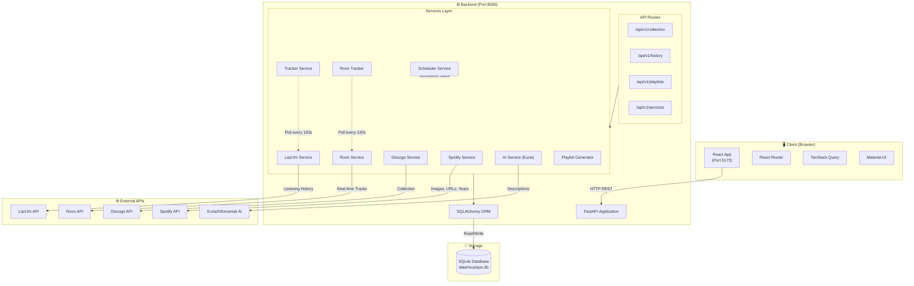
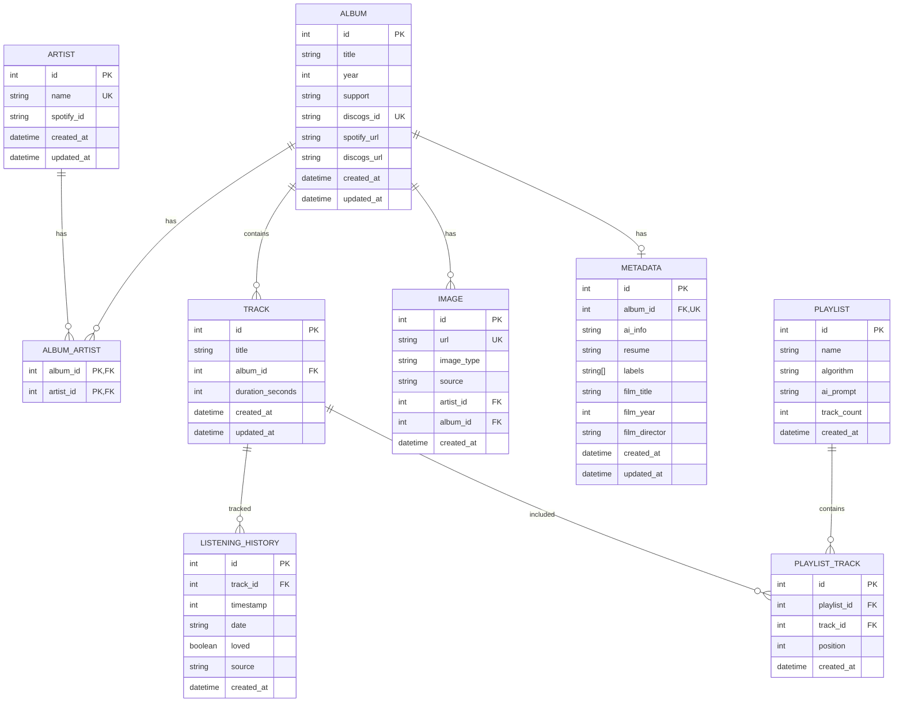
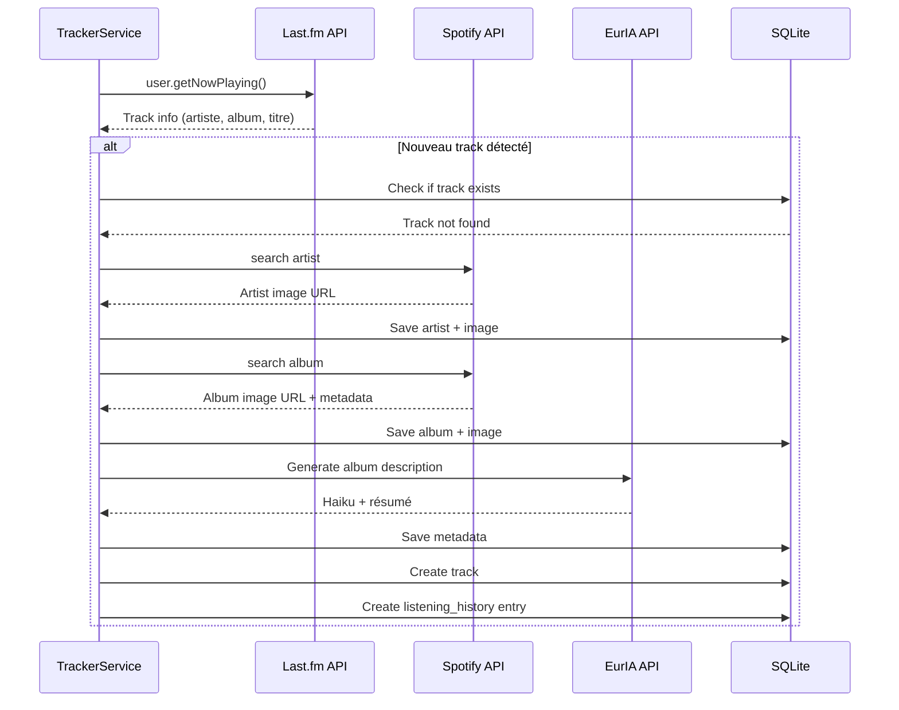
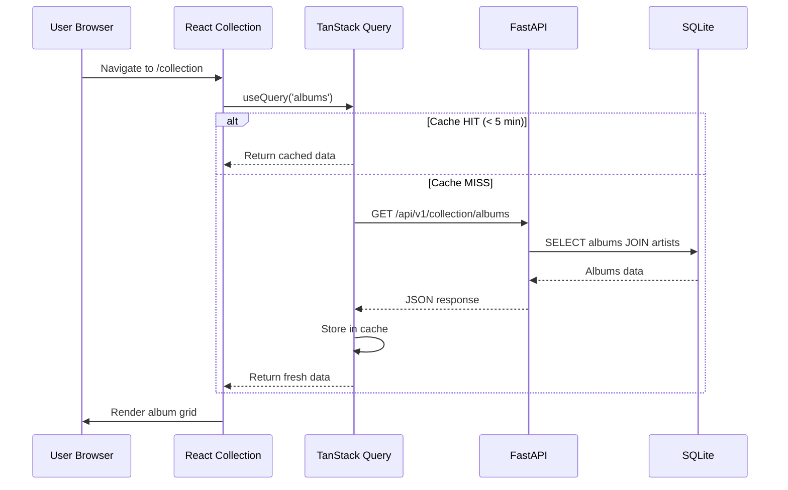
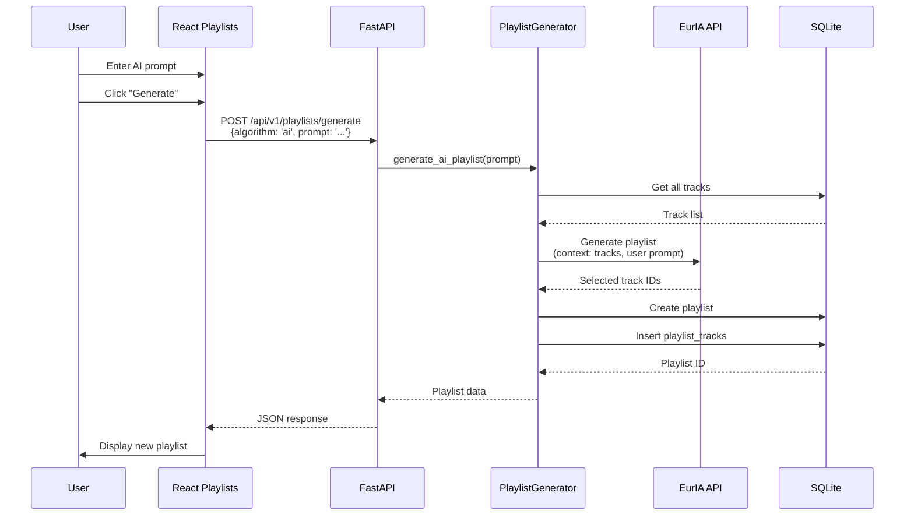

# 🏗️ Architecture Technique - AIME v4.0.0

## 📊 Vue d'Ensemble de l'Architecture



## 🗄️ Schéma de Base de Données



### 📋 Description des Tables

#### **ARTIST** - Artistes musicaux
- Stocke les informations des artistes
- Relation many-to-many avec ALBUM via ALBUM_ARTIST
- `spotify_id` optionnel pour enrichissement

#### **ALBUM** - Albums musicaux
- Collection Discogs et albums détectés
- Supports multiples : Vinyl, CD, Digital, etc.
- Enrichi automatiquement (Spotify, IA)

#### **ALBUM_ARTIST** - Table de liaison M2M
- Gère les albums avec plusieurs artistes
- Clé composite (album_id, artist_id)

#### **TRACK** - Morceaux musicaux
- Appartient à un album
- Peut avoir une durée
- Base pour l'historique d'écoute

#### **LISTENING_HISTORY** - Historique d'écoute
- Enregistrement de chaque écoute
- `source` : 'lastfm' ou 'roon'
- `loved` : marquage favori
- `timestamp` : Unix timestamp pour tri chronologique

#### **IMAGE** - Images multisources
- Polymorphique : artiste OU album
- Sources : Spotify, Last.fm, Discogs
- Types : 'artist', 'album'

#### **METADATA** - Métadonnées enrichies
- One-to-one avec ALBUM
- `ai_info` : description générée par IA
- Informations BOF (Bande Originale de Film)

#### **PLAYLIST** - Playlists intelligentes
- Générée par algorithme ou IA
- 7 algorithmes disponibles
- `ai_prompt` optionnel pour génération IA

#### **PLAYLIST_TRACK** - Contenu des playlists
- Ordre maintenu via `position`
- Référence aux tracks existants

## Structure des Fichiers

### Backend (FastAPI + Python)

```
backend/
├── app/
│   ├── __init__.py
│   ├── main.py                 # Point d'entrée FastAPI
│   ├── database.py             # Configuration SQLAlchemy
│   │
│   ├── core/                   # Configuration centrale
│   │   ├── __init__.py
│   │   └── config.py           # Settings (Pydantic)
│   │
│   ├── models/                 # Modèles SQLAlchemy (ORM)
│   │   ├── __init__.py
│   │   ├── artist.py           # Table artists
│   │   ├── album.py            # Table albums
│   │   ├── album_artist.py     # Table de liaison M2M
│   │   ├── track.py            # Table tracks
│   │   ├── listening_history.py # Table listening_history
│   │   ├── image.py            # Table images
│   │   ├── metadata.py         # Table metadata
│   │   └── playlist.py         # Tables playlists + playlist_tracks
│   │
│   ├── schemas/                # Schémas Pydantic (validation)
│   │   ├── __init__.py
│   │   ├── artist.py           # DTO artistes
│   │   ├── album.py            # DTO albums
│   │   ├── track.py            # DTO tracks
│   │   ├── history.py          # DTO historique
│   │   └── playlist.py         # DTO playlists
│   │
│   ├── api/v1/                 # Routes API REST
│   │   ├── __init__.py
│   │   ├── collection.py       # /collection/albums, /artists
│   │   ├── history.py          # /history/tracks, /timeline
│   │   ├── playlists.py        # /playlists
│   │   ├── services.py         # /services (tracker, sync)
│   │   └── search.py           # /search
│   │
│   ├── services/               # Logique métier
│   │   ├── __init__.py
│   │   ├── spotify_service.py  # Client Spotify API
│   │   ├── lastfm_service.py   # Client Last.fm API
│   │   ├── discogs_service.py  # Client Discogs API
│   │   ├── ai_service.py       # Client EurIA/Infomaniak
│   │   ├── tracker_service.py  # Tracker background (APScheduler)
│   │   └── playlist_generator.py # Générateur playlists
│   │
│   └── utils/                  # Utilitaires
│       └── __init__.py
│
├── requirements.txt            # Dépendances Python
└── Dockerfile                  # Image Docker backend
```

### Frontend (React + TypeScript)

```
frontend/
├── src/
│   ├── main.tsx                # Point d'entrée React
│   ├── App.tsx                 # Composant racine + routing
│   │
│   ├── pages/                  # Pages principales
│   │   ├── Collection.tsx      # Page albums Discogs
│   │   ├── Journal.tsx         # Page historique d'écoute
│   │   ├── Timeline.tsx        # Page timeline horaire
│   │   ├── Playlists.tsx       # Page playlists
│   │   ├── Analytics.tsx       # Page statistiques
│   │   └── Settings.tsx        # Page configuration
│   │
│   ├── components/             # Composants réutilisables
│   │   └── layout/
│   │       └── Navbar.tsx      # Barre de navigation
│   │
│   ├── api/
│   │   └── client.ts           # Client Axios configuré
│   │
│   ├── types/
│   │   └── models.ts           # Types TypeScript (interfaces)
│   │
│   └── styles/
│       └── theme.ts            # Thème Material-UI
│
├── public/
│   └── vite.svg                # Logo
│
├── index.html                  # Point d'entrée HTML
├── package.json                # Dépendances Node.js
├── tsconfig.json               # Config TypeScript
├── vite.config.ts              # Config Vite
├── nginx.conf                  # Config Nginx (production)
└── Dockerfile                  # Image Docker frontend
```

### Configuration & Scripts

```
├── config/
│   ├── app.json                # Configuration application
│   └── secrets.json            # API keys (GITIGNORE)
│
├── data/
│   ├── musique.db              # Base SQLite (créée auto)
│   └── backups/                # Backups DB
│       └── .gitkeep
│
├── scripts/
│   ├── setup.sh                # Installation complète
│   └── start-dev.sh            # Démarrage dev
│
├── docs/
│   ├── API.md                  # Documentation API
│   └── QUICKSTART.md           # Guide démarrage
│
├── docker-compose.yml          # Orchestration Docker
├── .gitignore                  # Fichiers ignorés Git
├── README.md                   # Documentation principale
└── PROJECT-SUMMARY.md          # Résumé du projet
```

## Flux de Données

### 1. Tracking Last.fm

```
TrackerService (toutes les 2 min)
    │
    ├─> LastFMService.get_now_playing()
    │       │
    │       └─> Last.fm API
    │
    ├─> SpotifyService.search_artist_image()
    │       │
    │       └─> Spotify API
    │
    ├─> SpotifyService.search_album_image()
    │       │
    │       └─> Spotify API
    │
    ├─> AIService.generate_album_info()
    │       │
    │       └─> EurIA/Infomaniak API
    │
    └─> Save to SQLite
            ├─> artists
            ├─> albums
            ├─> tracks
            ├─> listening_history
            ├─> images
            └─> metadata
```

### 2. Requête Frontend → Backend

```
React Component
    │
    ├─> TanStack Query (cache)
    │       │
    │       ├─> Cache HIT → Retour immédiat
    │       │
    │       └─> Cache MISS
    │               │
    │               └─> Axios (apiClient)
    │                       │
    │                       └─> FastAPI Route
    │                               │
    │                               ├─> Validation Pydantic
    │                               │
    │                               ├─> Business Logic
    │                               │
    │                               ├─> SQLAlchemy Query
    │                               │       │
    │                               │       └─> SQLite DB
    │                               │
    │                               └─> Response (JSON)
    │
    └─> React Render (UI update)
```

### 3. Synchronisation Discogs

```
User clicks "Sync Discogs"
    │
    └─> POST /api/v1/services/discogs/sync
            │
            └─> DiscogsService.get_collection()
                    │
                    └─> Discogs API
                            │
                            └─> Pour chaque album:
                                    ├─> Créer/récupérer artistes
                                    ├─> Créer album
                                    ├─> Ajouter images
                                    └─> Ajouter métadonnées
```

## Base de Données (SQLite)

### Schéma Relationnel

```
artists (1) ←──────┐
    ↓              │
    │              │ (M2M)
    │              │
    └─> album_artist ←─┐
                       │
albums (1) ←───────────┘
    ↓
    ├─> tracks (N)
    │       ↓
    │       └─> listening_history (N)
    │
    ├─> images (N)
    │
    └─> metadata (1)

playlists (1)
    ↓
    └─> playlist_tracks (N) ──> tracks
```

### Tables Principales

1. **artists** - Artistes musicaux
   - id, name, spotify_id, lastfm_url

2. **albums** - Albums musicaux
   - id, title, year, support, discogs_id, spotify_url

3. **album_artist** - Liaison Many-to-Many
   - album_id, artist_id

4. **tracks** - Pistes musicales
   - id, album_id, title, track_number, duration_seconds

5. **listening_history** - Historique d'écoute
   - id, track_id, timestamp, date, source, loved

6. **images** - URLs d'images
   - id, url, image_type, source, artist_id, album_id

7. **metadata** - Métadonnées enrichies
   - id, album_id, ai_info, resume, labels, film_*

8. **playlists** - Playlists générées
   - id, name, algorithm, ai_prompt, track_count

9. **playlist_tracks** - Tracks dans playlists
   - playlist_id, track_id, position

## Services Externes

### Last.fm
- **Usage**: Tracking d'écoute en temps réel
- **Fréquence**: Polling toutes les 2 minutes
- **Endpoint**: `user.getNowPlaying()`

### Spotify
- **Usage**: Récupération images artistes/albums
- **Auth**: Client Credentials Flow
- **Cache**: Images stockées en DB

### Discogs
- **Usage**: Import collection musicale
- **Fréquence**: Manuelle (button "Sync")
- **Endpoint**: `user.collection()`

### EurIA (Infomaniak AI)
- **Usage**: Génération descriptions albums
- **Modèle**: mistral-large-latest
- **Cache**: 80% hit rate (descriptions en DB)

## Déploiement

### Développement
```bash
./scripts/start-dev.sh
```
- Backend: http://localhost:8000
- Frontend: http://localhost:5173

### Production (Docker)
```bash
docker-compose up -d
```
- Backend: Container `music-tracker-backend`
- Frontend: Container `music-tracker-frontend` (Nginx)
- Accès: http://localhost:80

## 🔧 Composants Techniques Principaux

### Stack Frontend

#### **React 18 + TypeScript**
- Components fonctionnels avec hooks
- Typage strict TypeScript pour la fiabilité
- Hot Module Replacement (HMR) via Vite

#### **Material-UI (MUI)**
- Design System consistant
- Components customisés via `theme.ts`
- Responsive design natif
- Dark mode support (à implémenter)

#### **TanStack Query (React Query)**
- Cache client intelligent (5 min stale time)
- Invalidation automatique après mutations
- Loading/error states gérés automatiquement
- Retry logic configurable

#### **React Router v6**
- Navigation SPA fluide
- Routes protégées (à implémenter)
- Lazy loading des pages

#### **Axios**
- Client HTTP configuré avec baseURL
- Interceptors pour tokens (à implémenter)
- Gestion centralisée des erreurs

### Stack Backend

#### **FastAPI**
- Performance async (ASGI)
- Documentation OpenAPI auto-générée
- Validation Pydantic native
- CORS middleware activé

#### **SQLAlchemy 2.0**
- ORM moderne avec type hints
- Relationships eager/lazy loading
- Migration Alembic (à activer)
- Connection pooling

#### **APScheduler**
- Scheduler background tasks
- 4 jobs configurés (tracker, cleanup, etc.)
- Persistence SQLite
- Graceful shutdown

#### **Pydantic**
- Validation données entrée/sortie
- Settings management via environment
- Génération JSON schema automatique

### Architecture Services

#### **TrackerService**
- **Rôle**: Polling Last.fm toutes les 150s
- **Logique**: 
  - Récupération `nowPlaying` via Last.fm API
  - Détection nouveaux tracks
  - Enrichissement automatique (Spotify + AI)
  - Sauvegarde historique
- **État**: Actif/inactif toggleable via API
- **Fallback**: Retry 3x si API down

#### **RoonTrackerService** (v4.0.0)
- **Rôle**: Polling Roon local toutes les 120s
- **Logique**: 
  - Connexion WebSocket Roon Core
  - Récupération état lecture actuel
  - Enrichissement identique à Last.fm
  - Distinction source dans `listening_history.source`
- **Avantages**: Pas de rate limits, données temps réel

#### **SpotifyService**
- **Rôle**: Enrichissement images + métadonnées
- **Auth**: Client Credentials Flow (Bearer token)
- **Cache**: Images stockées en DB (évite API calls)
- **Endpoints utilisés**:
  - `search?type=artist` - Images artistes
  - `search?type=album` - Images albums + date sortie

#### **AIService (EurIA)**
- **Rôle**: Génération descriptions albums via IA
- **Modèle**: mistral-large-latest (Infomaniak)
- **Prompt**: Contexte album + demande haiku + résumé
- **Cache**: ~80% hit rate (métadonnées en DB)
- **Fallback**: Description vide si API down

#### **DiscogsService**
- **Rôle**: Import collection musicale complète
- **Auth**: OAuth 1.0a (token + secret)
- **Fréquence**: Manuelle (button UI)
- **Logique**:
  - Pagination 100 items/page
  - Dédoublonnage par `discogs_id`
  - Récupération détails release (label, année, format)
- **Limites**: 60 req/min (rate limit Discogs)

#### **PlaylistGeneratorService** (v4.0.0)
- **Rôle**: Génération playlists intelligentes
- **Algorithmes**:
  1. `recent` - 30 derniers tracks uniques
  2. `loved` - Tracks favoris (loved=true)
  3. `top_artists` - Top 10 artistes par écoutes
  4. `random` - Sélection aléatoire
  5. `discover` - Artistes peu écoutés
  6. `decade` - Filtrage par décennie
  7. `ai` - Génération via prompt IA
- **Cache**: Playlists persistées en DB

#### **SchedulerService** (v4.0.0)
- **Rôle**: Automatisation tâches récurrentes
- **Jobs configurés**:
  1. `cleanup_old_tracks` - Suppression écoutes >1 an (daily 3AM)
  2. `backup_database` - Backup SQLite (daily 2AM)
  3. `refresh_spotify_token` - Renouvellement auth (hourly)
  4. `compute_analytics` - MAJ stats (daily 4AM)
- **Persistance**: État jobs en DB SQLite

## 🔄 Flux Fonctionnels Détaillés

### Flux 1: Tracking d'une Nouvelle Écoute



### Flux 2: Affichage Page Collection



### Flux 3: Génération Playlist IA



## 🗃️ Modèle de Données Avancé

### Indexes Performants

```sql
-- Performances requêtes fréquentes
CREATE INDEX idx_artist_name ON artists(name);
CREATE INDEX idx_album_title ON albums(title);
CREATE INDEX idx_album_year ON albums(year);
CREATE INDEX idx_track_album ON tracks(album_id);
CREATE INDEX idx_history_track ON listening_history(track_id);
CREATE INDEX idx_history_timestamp ON listening_history(timestamp DESC);
CREATE INDEX idx_history_date ON listening_history(date);
CREATE INDEX idx_history_source ON listening_history(source);
CREATE INDEX idx_image_artist ON images(artist_id);
CREATE INDEX idx_image_album ON images(album_id);
CREATE INDEX idx_metadata_album ON metadata(album_id);
```

### Contraintes d'Intégrité

- **PRIMARY KEYS**: Auto-increment sur toutes tables
- **FOREIGN KEYS**: Cascade DELETE sur relations
- **UNIQUE**: 
  - `artists.name` - Pas de doublons artistes
  - `albums.discogs_id` - Import Discogs sans duplication
  - `(album_id, track_number)` - Numérotation unique par album
- **NOT NULL**: Champs critiques (name, title, timestamp)

### Optimisations Stockage

- **Images**: URLs uniquement (pas de BLOB)
- **Timestamps**: Unix epoch (INTEGER) pour performance
- **Dates**: Format ISO 8601 (TEXT) pour analytics
- **JSON**: Champs `metadata.ai_info` stockés en TEXT (SQLite native JSON support)

## Sécurité

- ✅ API keys dans `config/secrets.json` (GITIGNORE)
- ✅ CORS configuré pour origines autorisées
- ✅ Validation Pydantic sur toutes les entrées
- ✅ SQLAlchemy ORM (protection SQL injection)
- ⚠️ Pas d'authentification (à implémenter pour prod)

## Performance

### Backend
- Index DB sur artist_name, album_title, timestamp
- Pagination systématique (30-50 items)
- Connection pool SQLite (5 connexions)
- Cache HTTP (ETags) à implémenter

### Frontend
- TanStack Query cache (5 min stale time)
- Lazy loading images
- Pagination côté serveur
- Debounce recherche (300ms) à implémenter

## Monitoring

- ✅ Logs FastAPI (console)
- ✅ Statut tracker accessible via `/services/tracker/status`
- ⚠️ Métriques à implémenter (Prometheus)
- ⚠️ Health checks à améliorer

---

**Auteur**: Patrick Ostertag  
**Date**: 30 janvier 2026  
**Version**: 4.0.0
