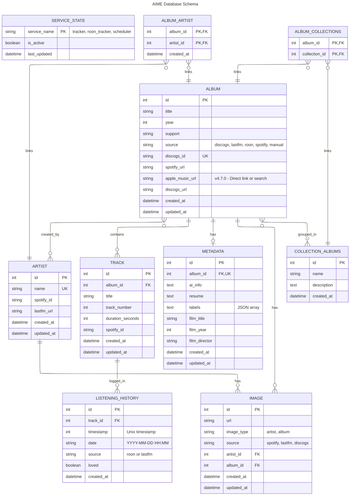

# Schéma Relationnel de la Base de Données

## Vue d'ensemble

Base de données SQLite pour AIME - AI Music Enabler avec 10 tables principales et 1 table de liaison.

## Diagramme ER (Entity Relationship)

## Description des Tables

### 🎵 Tables Musicales

#### **albums**
Albums musicaux provenant de différentes sources (Discogs, Last.fm, Roon, Spotify) avec enrichissements Spotify et Apple Music.
- **PK**: `id`
- **UK**: `discogs_id`
- **Columns**: 
  - `spotify_url` - URL directe Spotify (enrichissement Spotify)
  - `apple_music_url` - URL directe Apple Music ou search query (v4.7.0, enrichissement Euria futur)
  - `discogs_url` - URL Discogs
- **Indexes**: `title`, `source`, `idx_albums_spotify_url`, `idx_albums_apple_music_url` (v4.7.0)
- **Relations**: 
  - One-to-Many avec `tracks`
  - One-to-One avec `metadata`
  - One-to-Many avec `images`
  - Many-to-Many avec `artists` (via `album_artist`)
  - Many-to-Many avec `collections` (via `album_collections`)

#### **artists**
Artistes musicaux avec enrichissement Spotify/Last.fm.
- **PK**: `id`
- **UK**: `name`
- **Relations**:
  - One-to-Many avec `images`
  - Many-to-Many avec `albums` (via `album_artist`)

#### **tracks**
Pistes musicales appartenant à des albums.
- **PK**: `id`
- **FK**: `album_id` (CASCADE DELETE)
- **Relations**:
  - Many-to-One avec `album`
  - One-to-Many avec `listening_history`

### 📊 Tables de Données

#### **listening_history**
Historique d'écoute depuis Roon et Last.fm.
- **PK**: `id`
- **FK**: `track_id` (CASCADE DELETE)
- **Indexes**: `timestamp`, `date`, `source`
- **Relations**: Many-to-One avec `track`

#### **metadata**
Métadonnées enrichies (IA, Discogs, BOF).
- **PK**: `id`
- **FK+UK**: `album_id` (CASCADE DELETE, unique)
- **Indexes**: `album_id`, `film_title`
- **Relations**: One-to-One avec `album`

#### **images**
URLs d'images pour albums et artistes.
- **PK**: `id`
- **FK**: `artist_id` OR `album_id` (CASCADE DELETE, exclusive)
- **Indexes**: `artist_id`, `album_id`
- **Constraint**: Check que seulement artist_id OU album_id est rempli
- **Relations**: Many-to-One avec `artist` ou `album`

### 🎯 Tables Fonctionnelles

#### **collection_albums**
Collections personnalisées d'albums.
- **PK**: `id`
- **Relations**: Many-to-Many avec `albums` (via `album_collections`)

#### **service_states**
États de persistance des services background (auto-restart).
- **PK**: `service_name`
- **Values**: `tracker`, `roon_tracker`, `scheduler`

### 🔗 Tables de Liaison

#### **album_artist**
Table associative Many-to-Many entre albums et artistes.
- **PK Composite**: `album_id`, `artist_id`
- **FK**: `album_id`, `artist_id` (CASCADE DELETE)

#### **album_collections**
Table associative Many-to-Many entre albums et collections.
- **PK Composite**: `album_id`, `collection_id`
- **FK**: `album_id`, `collection_id` (CASCADE DELETE)

## Statistiques

- **11 tables** principales
- **5 relations One-to-Many**
- **3 relations Many-to-Many**
- **1 relation One-to-One**
- **13 indexes** pour optimisation (incluant `idx_albums_apple_music_url` v4.7.0)
- **2 contraintes** de validation

## Migrations

Les migrations Alembic sont dans `/backend/alembic/versions/` :
- `001_*` - Schema initial
- `002_*` - Add source column
- `003_*` - Add service_states table
- `004_*` - Playlist features
- `005_*` - Roon integration
- `006_*` - Additional enrichment
- `007_add_apple_music_url.py` - Apple Music integration (v4.7.0, 14 février 2026)
  - Added `apple_music_url` VARCHAR(500) nullable column
  - Created `idx_albums_apple_music_url` index for query optimization
  - Migration script: `/backend/migrate_add_apple_music_url.py` (direct SQLite, executed successfully)

---

*Dernière mise à jour: 14 février 2026 - v4.7.0 (Apple Music Integration)*
