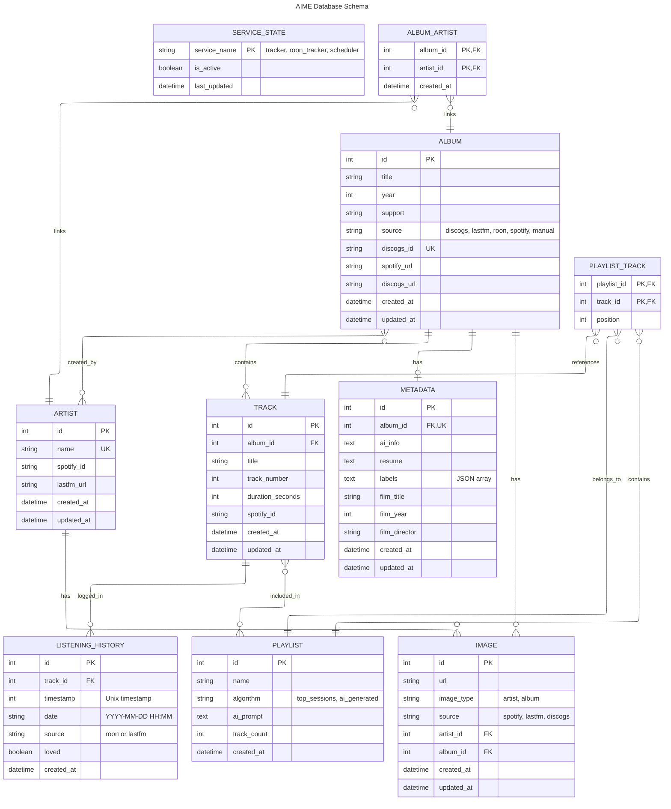

# Schéma Relationnel de la Base de Données

## Vue d'ensemble

Base de données SQLite pour AIME - AI Music Enabler avec 10 tables principales et 1 table de liaison.

## Diagramme ER (Entity Relationship)

## Description des Tables

### 🎵 Tables Musicales

#### **albums**
Albums musicaux provenant de différentes sources (Discogs, Last.fm, Roon, Spotify).
- **PK**: `id`
- **UK**: `discogs_id`
- **Indexes**: `title`, `source`
- **Relations**: 
  - One-to-Many avec `tracks`
  - One-to-One avec `metadata`
  - One-to-Many avec `images`
  - Many-to-Many avec `artists` (via `album_artist`)

#### **artists**
Artistes musicaux avec enrichissement Spotify/Last.fm.
- **PK**: `id`
- **UK**: `name`
- **Relations**:
  - One-to-Many avec `images`
  - Many-to-Many avec `albums` (via `album_artist`)

#### **tracks**
Pistes musicales appartenant à des albums.
- **PK**: `id`
- **FK**: `album_id` (CASCADE DELETE)
- **Relations**:
  - Many-to-One avec `album`
  - One-to-Many avec `listening_history`
  - Many-to-Many avec `playlists` (via `playlist_tracks`)

### 📊 Tables de Données

#### **listening_history**
Historique d'écoute depuis Roon et Last.fm.
- **PK**: `id`
- **FK**: `track_id` (CASCADE DELETE)
- **Indexes**: `timestamp`, `date`, `source`
- **Relations**: Many-to-One avec `track`

#### **metadata**
Métadonnées enrichies (IA, Discogs, BOF).
- **PK**: `id`
- **FK+UK**: `album_id` (CASCADE DELETE, unique)
- **Indexes**: `album_id`, `film_title`
- **Relations**: One-to-One avec `album`

#### **images**
URLs d'images pour albums et artistes.
- **PK**: `id`
- **FK**: `artist_id` OR `album_id` (CASCADE DELETE, exclusive)
- **Indexes**: `artist_id`, `album_id`
- **Constraint**: Check que seulement artist_id OU album_id est rempli
- **Relations**: Many-to-One avec `artist` ou `album`

### 🎯 Tables Fonctionnelles

#### **playlists**
Playlists générées (top sessions, IA).
- **PK**: `id`
- **Relations**: One-to-Many avec `playlist_tracks`

#### **playlist_tracks**
Table de liaison playlists-tracks avec position.
- **PK Composite**: `playlist_id`, `track_id`
- **FK**: `playlist_id`, `track_id` (CASCADE DELETE)
- **Relations**: Many-to-One avec `playlist` et `track`

#### **service_states**
États de persistance des services background (auto-restart).
- **PK**: `service_name`
- **Values**: `tracker`, `roon_tracker`, `scheduler`

### 🔗 Tables de Liaison

#### **album_artist**
Table associative Many-to-Many entre albums et artistes.
- **PK Composite**: `album_id`, `artist_id`
- **FK**: `album_id`, `artist_id` (CASCADE DELETE)

## Statistiques

- **10 tables** principales + 2 tables de liaison
- **7 relations One-to-Many**
- **3 relations Many-to-Many**
- **1 relation One-to-One**
- **12 index** pour optimisation
- **2 contraintes** de validation

## Migrations

Les migrations Alembic sont dans `/backend/alembic/versions/`:
- `001_*` - Schema initial
- `002_*` - Add source column
- `003_*` - Add service_states table

---

*Dernière mise à jour: 1er février 2026 - v4.3.1*
